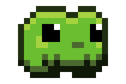

#  [`dandelion.computer`](https://dandelion.computer)

❤️🌱🌞🏳️‍🌈⚙️

## featured

  
  

  
  

  
  

  
  

  
  

  
  

---

frog art is ["Froggy"](https://caz-bee.itch.io/froggy) by [CazBee](https://caz-bee.itch.io/)
